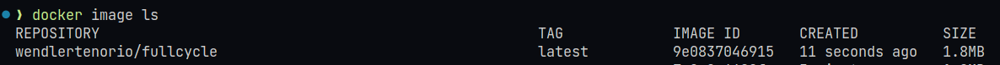

# Ambiente GO com Docker

Este repositório tem o objetivo de apresentar uma maneira de executar script GO em um container docker,
porém de forma otimizada utilizando os conceitos de multistage building

## Hello With Go

### 1. Baixando imagem docker

Uma vez com o [docker](https://www.docker.com/get-started/) instalado, realize o download da imagem:

```bash
docker pull wendlertenorio/fullcycle
```

### 2. Executando container

```bash
docker run wendlertenorio/fullcycle
```

Você deverá receber a simples mensagem:

```bash
Full Cycle Rocks!!
```

#### Multistage building

Ao utilizar o processo de construção da imagem final em etapas foi possível eliminar as dependências e recursos desnecessários, gerando assim uma imagem menor e mais eficiente para o propósito proposto:


